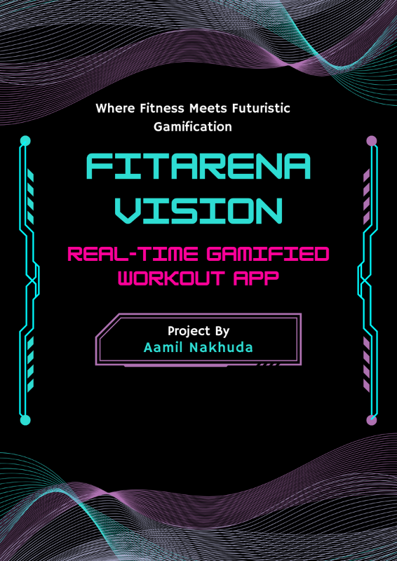

# 🎮+💪 FitArena Vision

## 🌐 Live Demo

You can try the real-time system here:

* [🌎 fitarena-vision.vercel.app](fitarena-vision.vercel.app)

---

## ✨ Table of Contents
- [Overview](#-overview)
- [Features](#-features)
- [Tech Stack](#-tech-stack)
- [Project Architecture](#-project-architecture)
- [My Role and Contributions](#-my-role-and-contributions)
- [Testing](#-testing)
- [Documentation](#-documentation)
- [Mockups](#-mockups)
- [License](#-license)
- [GitHub Repository](#-github-repository)
## 🚀 Overview

**FitArena Vision** is the world’s first real‑time feedback and real-time gamified workout app using computer‑vision pose estimation technology that is designed to transform traditional workouts into immersive, gamified experiences. Using real-time pose estimation via computer vision, it delivers instant feedback. This system aims to solve key challenges in modern fitness including lack of motivation, improper form, and accessibility barriers.

The project was conceptualized and executed as a solo participant for both the M.Sc. (IT) degree research project and Aavishkar Research Convention.

---

## ⚒️ Features

- **💪 Real-Time Pose Detection**: High-speed, browser-based tracking leveraging MoveNet Lightning model in Tensorflow.js to track body joints using standard webcams/front camera.
- **📢 Instant Feedback Loop**: Provides visual and audio feedback to correct exercise form in real-time.
- **🌟 Gamified Workout**:
    - Classic Chrome Dino + Push-Up Game: Push-ups to control an on-screen dino game.
    - Game Modes: Endurance Mode, Skill Mode, Race Against Time.
- **🚀 Browser-Based Implementation**: Works without any special equipment or app installation.
- **🚫 Equipment-Free Setup**: Requires only a device with a webcam/front camera.
- **🔁 For everyone**: Designed for all fitness levels and age groups.

---

## 📦 Tech Stack

- **Front-End**: HTML, CSS, JavaScript
- **Game Engine**: Phaser.js
- **Pose Estimation**: TensorFlow.js (MoveNet Lightning Model)
- **Responsive Design**: Custom UI with mobile and desktop layout handling
- **Hosting**: Vercel

---

## 🧑‍💻 My Role and Contributions

This was a **solo project** built from concept to deployment:

- **Research Lead**: Conducted more thane 15 hours of research on gamification, AI fitness, and pose estimation.
- **Developer**: Wrote game logic and pose estimation pipelines in JS/Phaser.js.
- **Designer**: Designed simple UI/UX for all age groups.
- **Presenter**: Delivered formal research presentation at Aavishkar Research Convention and university evaluation.
- **Tester**: Performed edge-case testing across devices.

---

## 🧪 Testing
The app was rigorously tested in the following ways:

- **Functional Tests**: Pose tracking accuracy, game trigger accuracy & reliability
- **Device Testing**: Verified compatibility with Chrome, Edge; tested on Android & Windows
* **Unit Testing:** Verified core logic components like game and exercise counting and realt-time feedback on the exercise mistakes.
* **Integration Testing:** Ensured smooth interaction across entire game.
* **System Testing:** Evaluated full app flow on physical devices.
---

## 📄 Documentation

The complete documentation is available in PDF format 
  

👉🔗 [Click here to read the full FitArena Vision Documentation (PDF))](docs/FitArena-Vision-Documentation.pdf)

---

## 📊 Presentation

The complete presentation is available in PDF format 

👉🔗 [Click here to view the full FitArena Vision Presentation (PDF))](docs/FitArenaVision-Presentation.pdf)

---

## 📸 Mockups / Screenshots
#### Mobile Screenshots
[Mobile Screenshots](images/FitArena-Vision-MobileScreenshots.pdf)
#### Laptop Screenshots
[Laptop Screenshots](images/FitArena-Vision-LaptopScreenshots.pdf)
#### How it would look like people using FitArena Vision
[How it would look like people using FitArena Vision](images/PeopleUsing_FitArenaVision.pdf)

##### Stock Images & Mockups are designed by Freepik & Pexels

---

## 🔒 License

This project is **not licensed** for use, copying, modification, or distribution.

All rights are reserved by the author.  
Unauthorized use of any part of this repository is strictly prohibited.

© 2025 Aamil Nakhuda. All rights reserved.

---

## 🔗 GitHub Repository

🔗 [FitArena Vision on GitHub](github.com/aamil-nakhuda/fitarena-vision)

---
